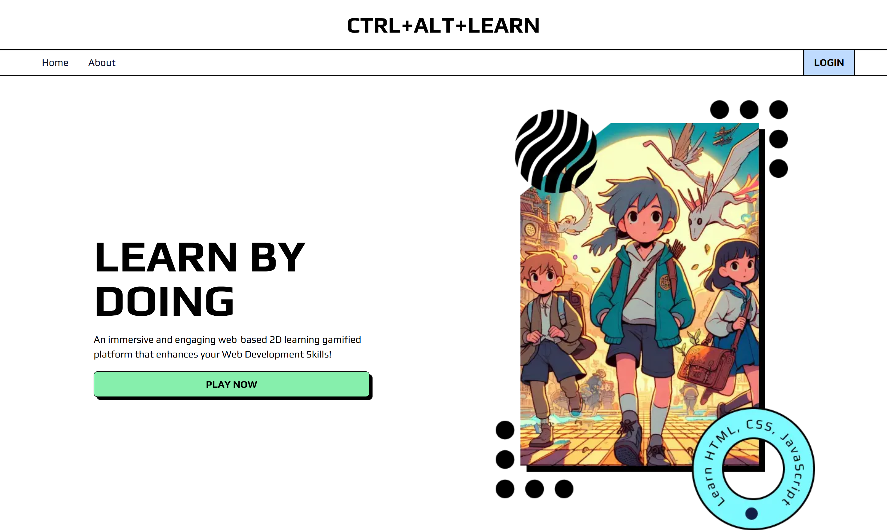
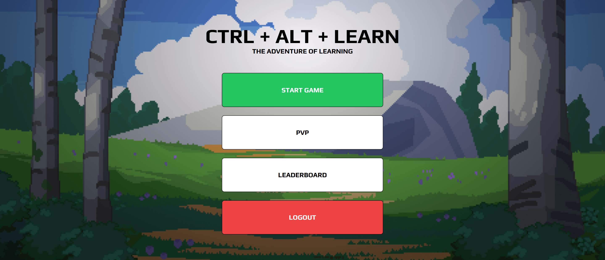
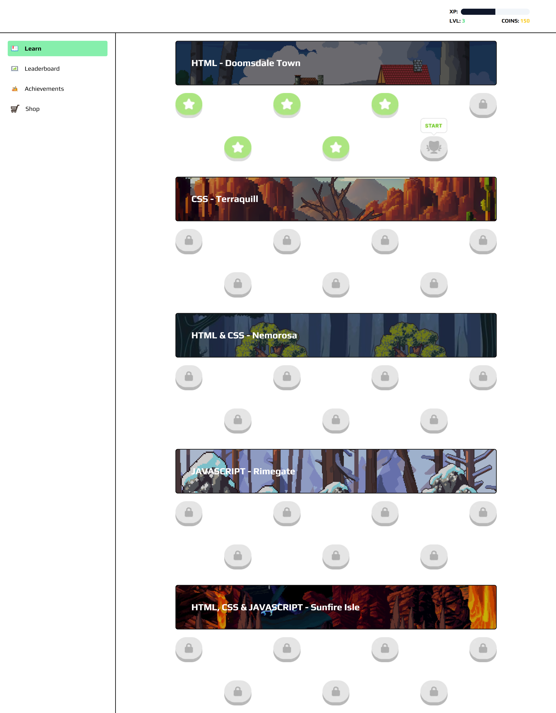
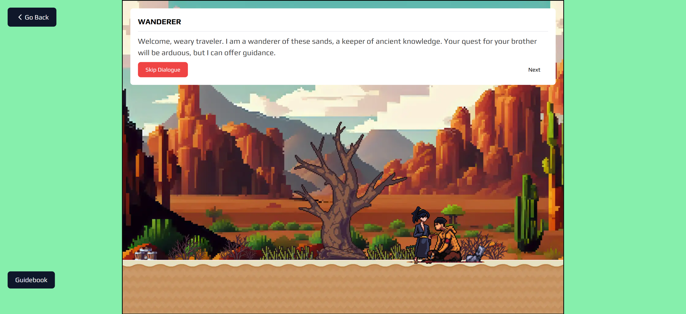
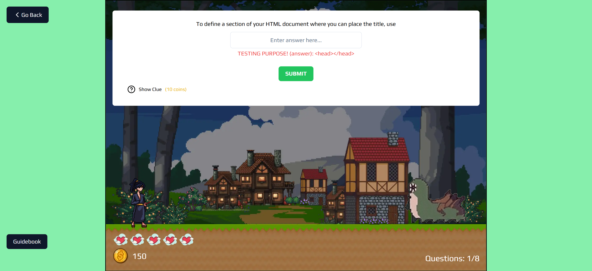
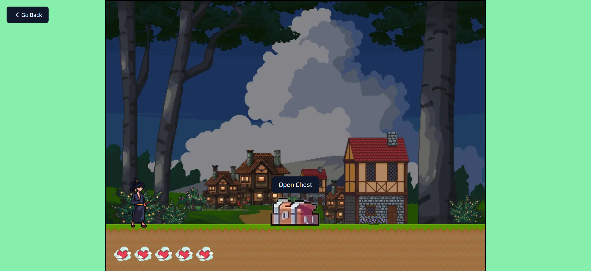
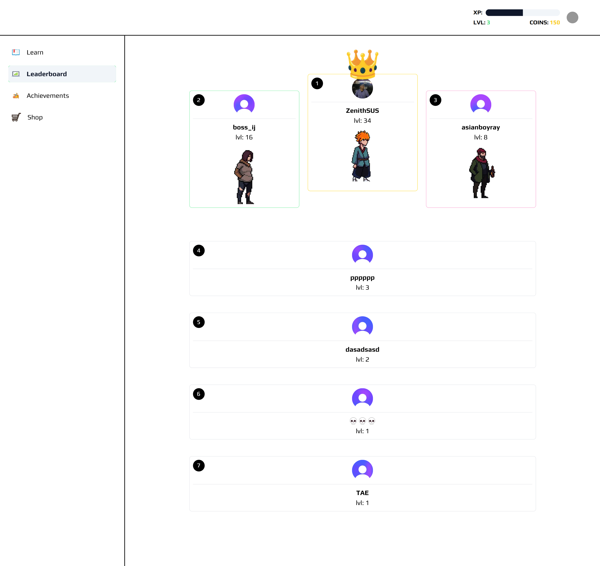
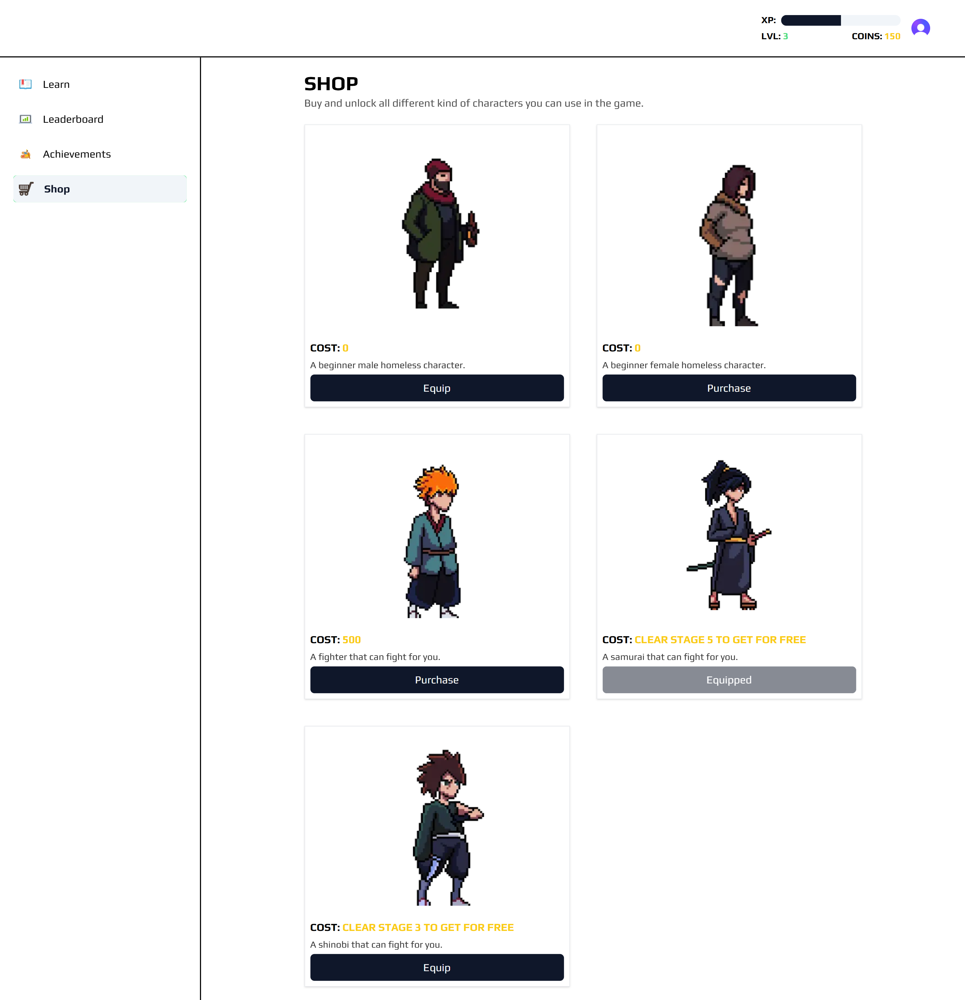

# Ctrl + Alt + Learn

The name "Ctrl+Alt+Learn" is a playful nod to the familiar keyboard shortcuts used in computing. "Ctrl+Alt+Delete" is a well-known command for restarting or troubleshooting a computer, symbolizing a fresh start or a solution to a problem. In the context of this platform, "Ctrl+Alt+Learn" signifies a fresh and engaging approach to learning web development.

The "Ctrl+Alt+Learn: A web based 2D gamified learning platform" aims to address the challenges in teaching web development by creating an engaging and effective learning experience through gamification.
## Objectives

- 🎮 Gamification and Progression System
- 🏫 Progressive Skill Building
- 🌏 Visually Appealing 2D Game World
- 📚 Comprehensive Learning Resources
- 🥳 Achievements and Milestones
- 🔐 Save/Load System
- 🧑‍🤝‍🧑 Character Selection
- 👤 PVP Functionality

## Screenshots

### The Landing Page

### The Start Page

### The Stage Selection Page

### The Dialogue Page

### The Boss Page

### The Reward Page

### The Leaderboard Page

### The Shop Page

## Authors
### Main Developer (me)
- Github: [@briuwu](https://www.github.com/briuwu)
- Instagram: [_briuwu](https://www.instagram.com/_briuwu/)

